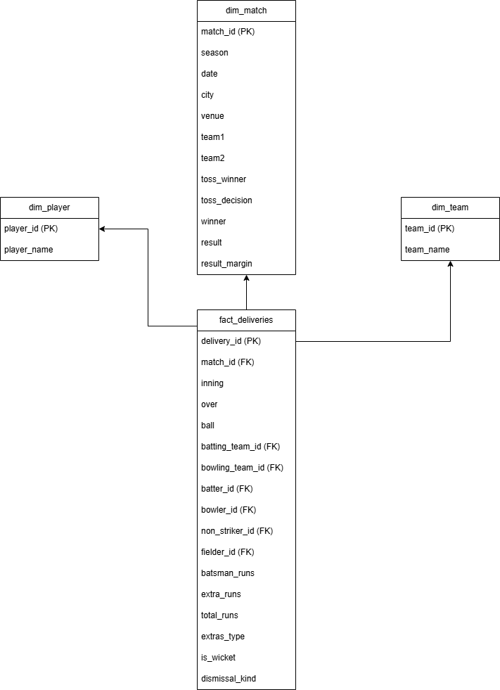

# IPL Data Pipeline

An end-to-end data pipeline that ingests, cleans, models, and analyzes IPL cricket data (2008–2024), built to practice core data engineering fundamentals: data cleaning, dimensional modeling, and SQL-based analysis.

## Project Overview

Raw IPL match and ball-by-ball data is messy in realistic ways — inconsistent season formats, duplicate team names from franchise rebrandings, and structural nulls. This project takes that raw data through a full pipeline:

## Data Source

- `matches.csv` — 1,095 rows, one row per match
- `deliveries.csv` — 260,920 rows, one row per ball bowled

Source: [Kaggle IPL dataset]https://www.kaggle.com/datasets/patrickb1912/ipl-complete-dataset-20082020/data

## Data Cleaning

Three real data quality issues were identified and fixed:

1. **Inconsistent season formats** — seasons appeared as both `'2007/08'` and `'2009'`. Normalized all seasons to a single starting year (e.g. `2007/08` → `2007`) for consistent time-based analysis.
2. **Duplicate team names from rebranding** — franchises were renamed over the years (e.g. `Delhi Daredevils` → `Delhi Capitals`, `Kings XI Punjab` → `Punjab Kings`). Without fixing this, the same franchise would be split across multiple names in any aggregation. Standardized all team references to current names.
3. **Structural nulls** — columns like `dismissal_kind` and `fielder` are null on most rows by design (most balls don't end in a wicket). Filled these with `'none'` rather than treating them as missing data, since the null itself is meaningful.

## Data Model

Designed as a star schema, with `fact_deliveries` (grain: one row per ball bowled) at the center, surrounded by `dim_match`, `dim_player`, and `dim_team`.

**Key design decision — role-playing dimension:** `dim_player` is referenced four separate times from the fact table (`batter_id`, `bowler_id`, `non_striker_id`, `fielder_id`) rather than creating separate tables per role. A player is one entity regardless of whether they're batting or bowling in a given delivery — splitting this into multiple tables would make it impossible to answer questions spanning both roles (e.g. a player's total runs *and* wickets). `dim_team` follows the same pattern for `batting_team_id` / `bowling_team_id`.

## Tech Stack

- Python (pandas) — data cleaning and transformation
- SQL — analysis queries
- Git/GitHub — version control

## Sample Analysis

All queries run against the SQLite database using `pd.read_sql()`.

**Top 5 Teams by Total Wins (2008–2024)**

| Team | Wins |
|---|---|
| Mumbai Indians | 144 |
| Chennai Super Kings | 138 |
| Kolkata Knight Riders | 131 |
| Royal Challengers Bengaluru | 123 |
| Sunrisers Hyderabad | 117 |

**Top 5 Run Scorers of All Time**

| Player | Total Runs |
|---|---|
| V Kohli | 8,014 |
| S Dhawan | 6,769 |
| RG Sharma | 6,630 |
| DA Warner | 6,567 |
| SK Raina | 5,536 |

**Top 5 Wicket Takers of All Time**

| Player | Total Wickets |
|---|---|
| YS Chahal | 213 |
| DJ Bravo | 207 |
| PP Chawla | 201 |
| SP Narine | 200 |
| R Ashwin | 198 |

**Key Insight — IPL Expansion Effect**
Season-wise analysis shows a clear jump in 2022 when IPL expanded from 8 to 10 teams
(Gujarat Titans and Lucknow Super Giants joined), increasing matches from ~60 to ~74 per
season and total runs from ~19,000 to ~25,000 per season.

## Project Status

✅ Complete — pipeline runs end to end: raw CSVs → cleaned data → star schema → SQLite database → SQL analysis.